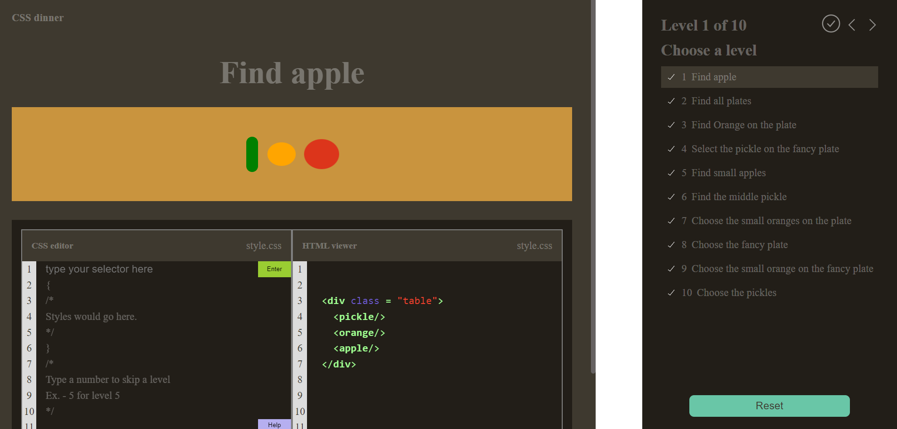

# RSS CSS selectors

### CSS selectors train.

## The tech stach are:

- Native JS (OOP)
- Typescript
- SASS(SCSS) with the BEM methodology
- Webpack for dev server and the project build

## In order to launch this project locally you will need to:

- clone the project repo
- npm i to install all the required dependencies
- npm run dev to start your local dev server.

[Link to the page deploy](https://rolling-scopes-school.github.io/nikolaykrishtopa-JSFE2023Q1/RSS-CSS-Selectors/)
